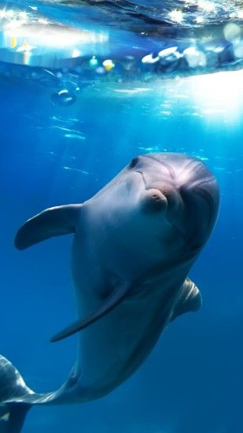

# Happy-gitting-

Just try out the git thing and enjoy gitting!

Here is a cute dolphin:

I love dolphins but I haven't figure out a way to have one at home
yet...  But we'll get there!

## A quick markdown primer:

### Different headings:

# This is an H1
## This is an H2
###### This is an H6

### Text in different style:

Hey, here is something *italicized* and here is some other thing
**bold**.

__I want this whole sentence bold, but only *this part* to be
italicized and bold.__ This part won't have any emphasis added.

### Links:

Check out [this
link](https://canvas.uw.edu/courses/1449798/pages/course-schedule)!

### Images: 

Check the dolphine image.  The exclamation mark in front of it means
to load the image into the text, otherwise you have just link but no
image. 
